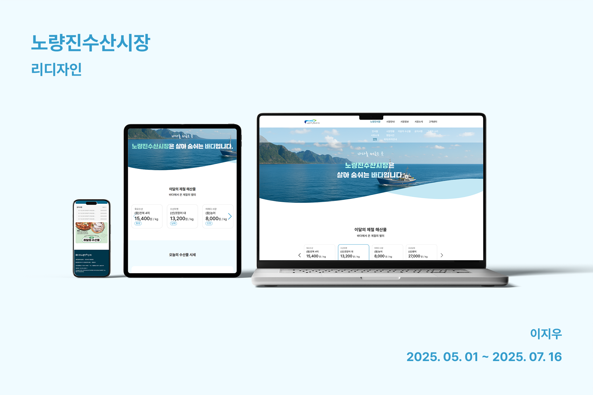

# 🐟 노량진수산시장 웹사이트 리디자인



### 👩🏻 개인 프로젝트
**배포 URL:** https://noryangjin.netlify.app

----

## 프로젝트 소개
- 노량진수산시장은 소비자에게 ‘신선도·안전성·투명성’을 보여줍니다.
- 대분류 6개‧하위 40여 개로 핵심 콘텐츠 진입이 어려웠던 기존 메뉴를 간략하게 하여 소비자가 필요한 정보만 보여주게끔 합니다.
- 기존 시세·통계·연혁 등 방대한 정보들이 복잡해 보이는 것을 직관적으로 보이게 했습니다.
- 리디자인 핵심은 네비게이션 간소화, 모바일에서 볼 수 있게 반응형으로 만들기, 카드 슬라이더·시세 테이블 도입, 불필요한 콘텐츠는 통합하였습니다.

----

## 1. 개발 환경
- **Front:** HTML5, SCSS
- **플러그인:** Bootstrap5, Swiper.js
- **빌드 & 배포:** Netlify  
- **버전 관리:** GitHub  
- **디자인:** Figma  

---- 

## 2. 프로젝트 구조

```text
FishMarket/
├── README.md
├── index.html
├── sub1-1.html # 인사말 페이지
├── sub1-2.html # 시장소개 페이지
├── sub1-3.html # 연혁 페이지
├── sub2-1.html # 시장현황 페이지
├── sub2-2.html # 영업시간 안내 페이지
├── sub2-3.html # 위치/주차 안내 페이지
├── sub3-1.html # 이달의 수산물 페이지
├── sub4-1.html # 공지사항 페이지
├── sub5-1.html # 고객의 소리 페이지
└── assets/
  ├── css/
  ├── scss/
  │ ├── commons.scss
  │ └── style.scss
  │          .
  │          .
  │          .
  │
  └── images/ # 이미지 리소스
    └── icons/ # 아이콘
```

----

## 3. 개발 기간 및 작업 관린

### 개발 기간
- 전체 개발 기간: 2025. 05. 01 ~ 2025. 07. 16
- 디자인 기간: 2025. 05. 10 ~ 2025. 06. 10
- 개발 기간: 2025. 06. 10 ~ 2025. 07. 16

### 작업 관리
- github로 작업 진행하였습니다.